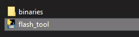
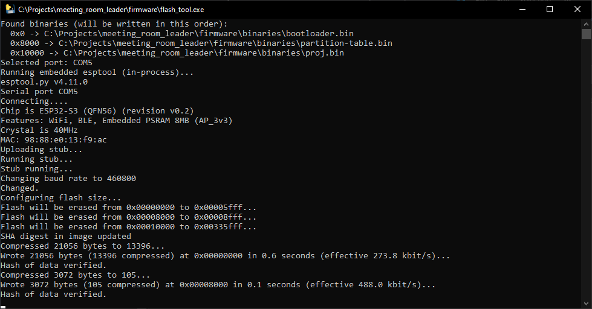

# Quick Installation

This guide explains how to install the firmware on the CrowPanel and configure the application.

## Overview

Installation consists of two main steps:

1. Flash the firmware using `flash_tool.exe`.
2. Configure the connect the panel to Wi-Fi.

---

## Flash the Firmware using `flash_tool.exe`

### 1. Download and Extract the Firmware

1. Download the [`Firmware.zip`](https://github.com/Grovety/meeting_room_support/raw/main/firmware/Firmware_support.zip) archive.
2. Extract the archive to a folder on your computer.

### 2. Connect the CrowPanel to Your PC

Connect the CrowPanel 3.5" to your PC using a USB Type-C cable.

> **Note**
>
> After connecting the CrowPanel to your PC, you should hear the Windows sound indicating that a new USB device has been connected.
> You can also verify the connection by opening **Device Manager** and checking that a new COM port appears.

### 3. Install the USB-to-Serial Driver if Needed

If no new COM port appears, you may need to install the USB-to-Serial driver.

Without this driver, `flash_tool.exe` may not detect the device.

To install the driver:

1. Go to the Silicon Labs CP210x driver page:  
   https://www.silabs.com/developers/usb-to-uart-bridge-vcp-drivers
2. Download the Windows 64-bit driver.
3. Install the driver following the vendor instructions.
4. Reboot your computer.
5. Reconnect the board.

After reconnecting, the board should appear in **Device Manager** as a COM port.

### 4, Run the Flash Tool

1. Run `flash_tool.exe` from the extracted firmware folder.
2. Wait until the flashing process is complete.

Once the process is complete, the application will start automatically on the panel.

### 5. Restart the Panel

1. Close the installer window.
2. Disconnect and reconnect the USB cable to restart the panel.

---

# Applocation Setup

After installing the firmware, configure the device.

You need to set up:

1. Wi-Fi connection.

The panel can be configured using the desktop application or directly from the panel UI.

---

## Applocation Setup with the Desktop Application

Download the [`PanelConfigurator.exe`](https://github.com/Grovety/meeting_room_leader/raw/main/app/PanelConfigurator.exe) application.

## Connect to Wi-Fi

1. Run `PanelConfigurator.exe`.

   The configurator will open and automatically detect the panel`s COM port.

2. Enter your Wi-Fi credentials:

   - **SSID** — Wi-Fi network name.
   - **Password** — Wi-Fi password.

3. Click **Send Wi-Fi** to transfer the configuration to the panel.

---

## Troubleshooting

### Problem: **Screen does not turn on after flashing**

**Solution:**

- Check the USB cable connection.
- Make sure the flashing process completed without errors.
- Power-cycle the board.
- Repeat the flashing process if necessary.

---

### Problem: **Board is not detected as a COM port**

**Solution:**

- Make sure the CP210x driver is installed.
- Try a different USB cable.
- Restart your PC.
- Check **Device Manager** for unknown devices.

---

### Problem: **Wi-Fi does not connect**

**Solution:**

- Verify the Wi-Fi password.
- Use a 2.4 GHz Wi-Fi network (the ESP32-S3 does not support 5 GHz).
- Restart the board.

---